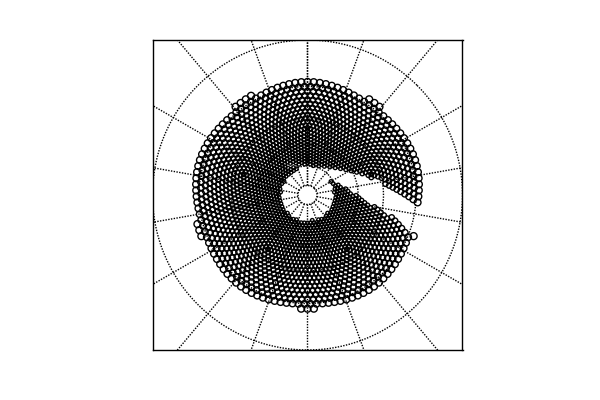
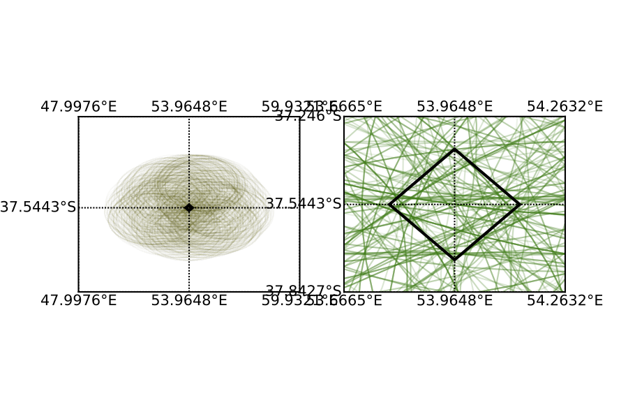

# Framework for Simulated Observations of Variable Astrophysical Sources over Large Sky Areas 
RB: I mostly want to achieve two things (a) tell people that they can use this framework to write own simulations with sources they care about adding only information about their sources in the form of a population and (b) The calculations that they will be using are correct (approximately correct as discussed here)
## Abstract
- Present tools to create parallel simulated catalog observations of variable astrophysical sources over large sky areas
- simulations can be made based on information from the survey, sky brightness model and user supplied information on the astrophysical source
- For the LSST baseline observing strategies these are provided by the OpSim output and user must provide information about the sources in the form of a population model and light curve model as described here
- Here we discuss the methodology used by these tools and demonstrate that the computations done by the tools described here work
## Introduction
### Description of the Problem
- Photometric Surveys for transients over large sky areas have been planned, Ongoing DES, PTF, Upcoming ZTF, LSST
- Need to be planned carefully
- Catalog simulations are essential for this functionality since they enable analysis that can be used to determine scientific results
- How do we perform such catalog simulations of objects of interest?

## Description of Problem input and output
- Survey Description : time of observations, pointing of telescope (field of view), environmental conditions five sigma depth 
- Object description : population statistics, model light curve in observer frame, Ignore motion
- final output desired: Two tables per object

### Desirable Features
- Parallelization
- Reproducibility
- Ability to rerun a small part of the survey
- Ability to simulate a single light curve
- Environmental Context
- Understanding selection effects

## Non-trivial Model independent steps
- Sky Brightness and five sigma depth calculation : provided by opsim / sky brightness model
- Obtaining observations corresponding to a astrophysical source
### Obtaining the sequences of pointings that observe a source 
- Hard as there are many observations NObs and many sources NSources with observations usually overlapping and dithered 
- To find the pointings that observe each source naively requires O(NObs) * O(Nsources) distance computations. for large areas like like LSST and large numbers of objects this is slow ~ 10^12
- overlaps and dithers imply that we cannot use the LSST fields
- Can be improved by spatial grouping in two modes :
    - tesellate the sky into small tiles. observations representing a tile are roughly good enough for each object on tile. We use the maximal set of observations per tile.
    - If neessary, we can get an accurate estimates by doing distance computations for each point. More computationally intensive, but for roughly uniformly distributed sources, tiles that are a fraction f of the original area, the number of distance computations required is f * total number of computations. For the kinds we are looking at, 1/f = 12 * 256 * 2 ~ 5 million. Implying that the number of distance calculations we need is ~ million
    - This of course requires a computation to build , and hierarchical methods that take advantage of this are O(f log f), but we are pre-calculating this and providng the result as 2 column, indexed sqlite database. For these orders this amounts to a ~ 4 GB database before indexing, and about ~ 20 GB database after indexing 
    - in practice we are using Healpix Tesselations, but methods of simulation don't explicitly depend on anything specifically connected to Healpix, but on the methods and attributes of a Tesselation class. Can be changed.
   - The key object returned is the set of pointings that intersect with the tile 

#### Demonstration that this is correct
- Estimate the number of times a point inside such a healpixel is incorrectly estimated in the average representation
    - Draw 100 objects on a single healpixel uniformly located
    - Create a fileDBobject with these locations and a constant magnitude
    - Make instance catalogs for these locations. Should be of the order of ~ 1000 - 2000 instance catalogs
    - Dump together and get pointings for each object
    - Estimate representative average for Healpixel that we are using (should have more pointings than the number of pointings for any object, since it is the maximal set, how many?)
    - Prune the results by distance computation and show that this is matches the instance catalog light curves?
    - Statistics : median number of overestimated observations per object over the healpixel from the maximal set 

## Demonstrate the simulation methodology 
- use minion 1 year or enigma micro, or minion and small area
- use a spatial model which is uniform
- use sinosoidal light curve which is parabolic in rest frame time,  no K correction
- Produce light curves 
